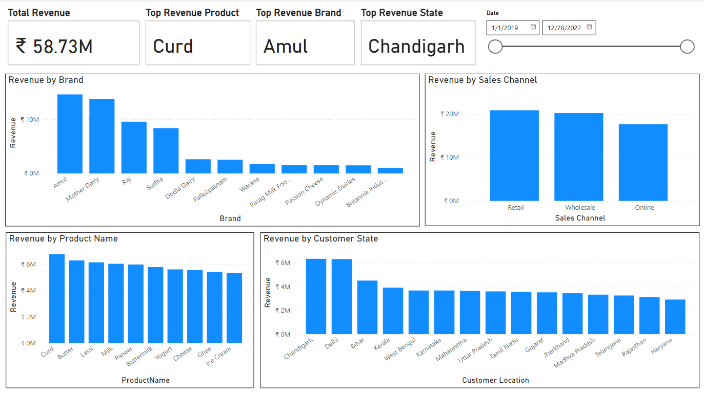
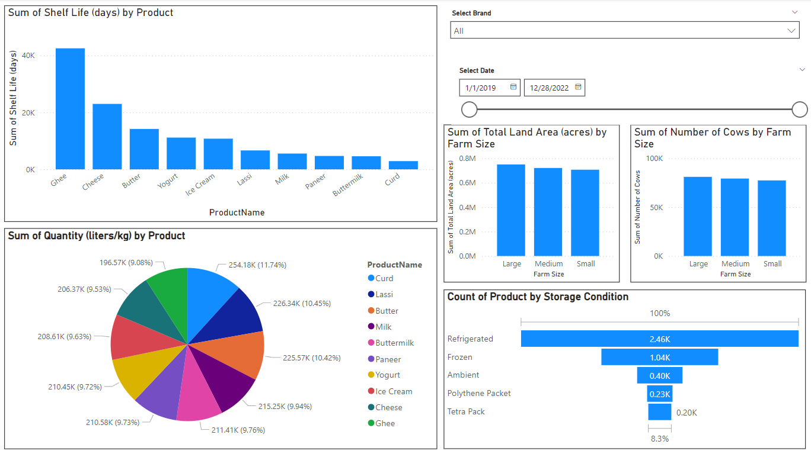

# Dairy Sales Insights Dashboard

## Overview
This repository features a Power BI dashboard for analyzing dairy sales data. The dashboard leverages insights from the **Dairy Sales dataset** sourced from Kaggle to provide a comprehensive overview of dairy product performance across various dimensions like location, farm size, and storage conditions.

## Dataset
The dataset contains the following fields:
- **Location**: State or region of the farms.
- **Farm Size**: Size of the dairy farms.
- **Product Names**: Types of dairy products.
- **Brand Names**: Brands producing the products.
- **Production Quantity**: Amount of products produced.
- **Sold Quantity**: Amount of products sold.
- **Price per Unit**: Selling price per unit of products.
- **Product Shelf Life**: Duration the products remain usable.
- **Storage Conditions**: Storage requirements for products.
- **Revenue**: Revenue generated by each brand.

## Key Features
1. **Total Revenue**: Displays the overall revenue across all brands and locations.
2. **Top Revenue Product**: Highlights the dairy product with the highest revenue.
3. **Top Revenue Brand**: Identifies the brand contributing the most revenue.
4. **Top Revenue State**: Shows the state generating the highest revenue.
5. **Shelf Life by Products**: Visualizes the average shelf life of different products.
6. **Sum of Quantity by Products**: Aggregates sold quantities by product type.
7. **Count of Products by Storage Condition**: Categorizes products based on their storage requirements.
8. **Total Farm Size by States**: Summarizes the total farm size in each state.
9. **Cow Count by Farm Size**: Provides insights into the number of cows based on farm size.

## Visualizations
The following visualizations are used to represent the data:
- **Stacked Charts**: For comparing revenue and quantities across multiple categories.
- **Pie Chart**: For visualizing proportions like product or brand contributions.
- **Funnel Chart**: For analyzing sales stages or hierarchical data.
- **Slicers**: To filter data by brand and date for more specific insights.

## Screenshots
### Main Dashboard Views

## Tools & Technologies
- **Power BI**: Used for data modeling, analysis, and visualization.
- **DAX**: For creating calculated columns and measures to extract meaningful insights.

## Learnings
Through this project, I gained experience in:
- Working with datasets involving multiple attributes and relationships.
- Designing interactive and visually appealing dashboards in Power BI.
- Utilizing advanced visualizations like Funnel Charts and Slicers for detailed analysis.

## Future Enhancements
- Include customer demographic analysis to identify purchasing patterns.
- Add predictive analytics to forecast future sales and trends.
- Enhance interactivity by integrating dynamic KPIs and drill-down visuals.

## How to Use
1. Download and open the Power BI file (`DairySales.pbix`) using Power BI Desktop.
2. Explore the dashboard to gain insights into dairy sales performance.
3. Customize the visuals or formulas as per your requirements.

## Contact
Feel free to connect with me on [LinkedIn](https://www.linkedin.com/in/kunalkawate/) for feedback or collaboration opportunities.

## License
This project is licensed under the MIT License - see the LICENSE file for details.
